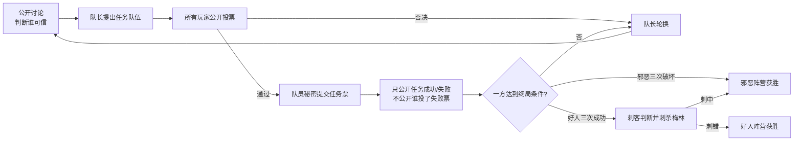
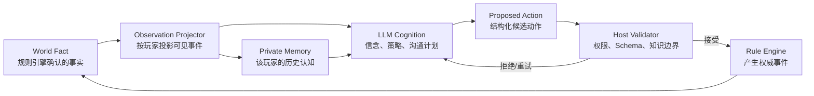
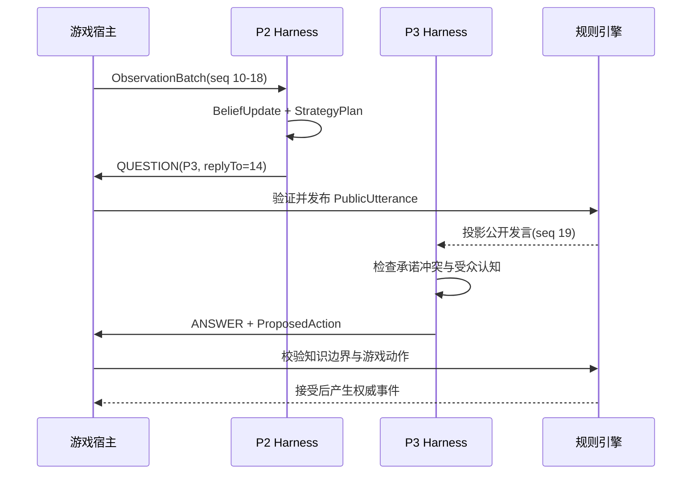
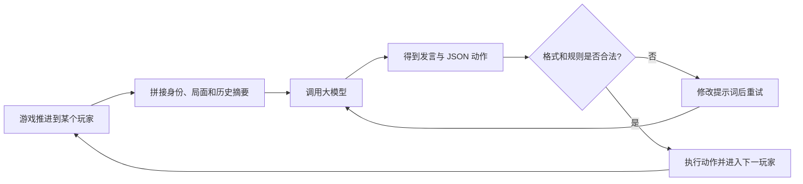
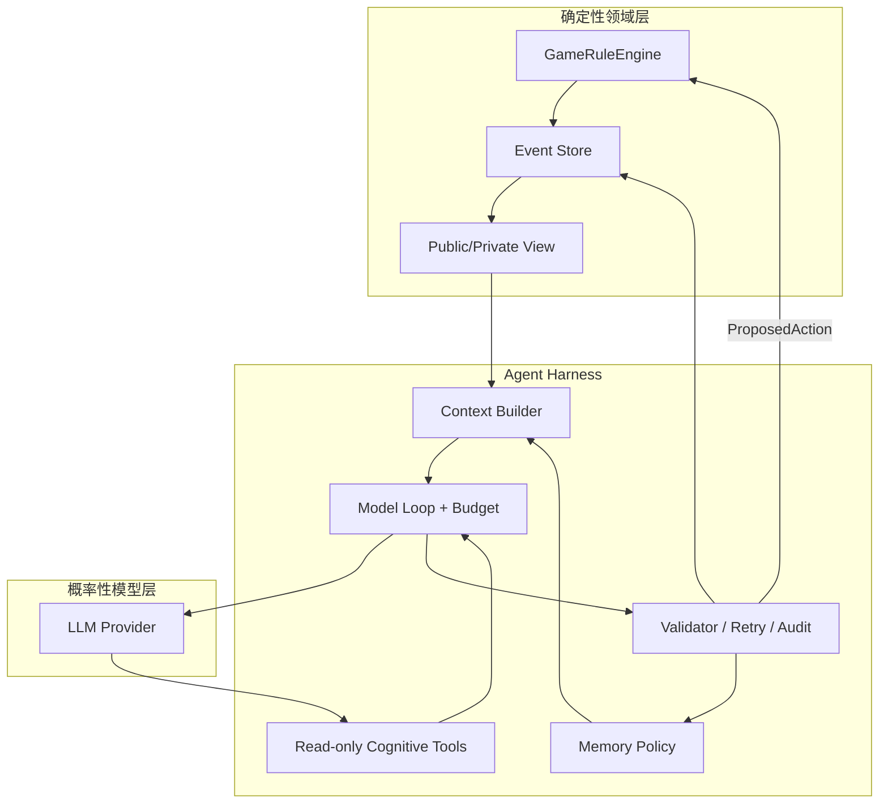
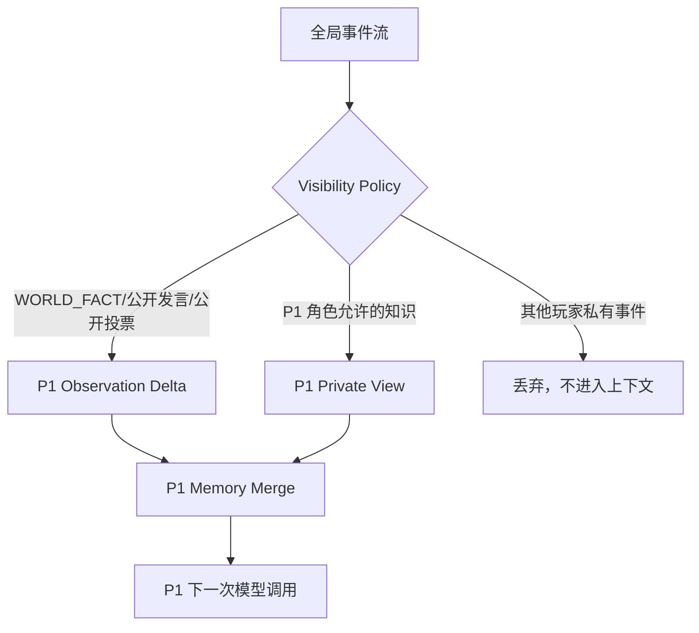
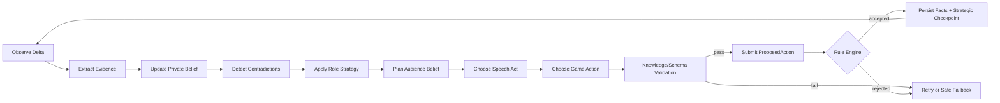
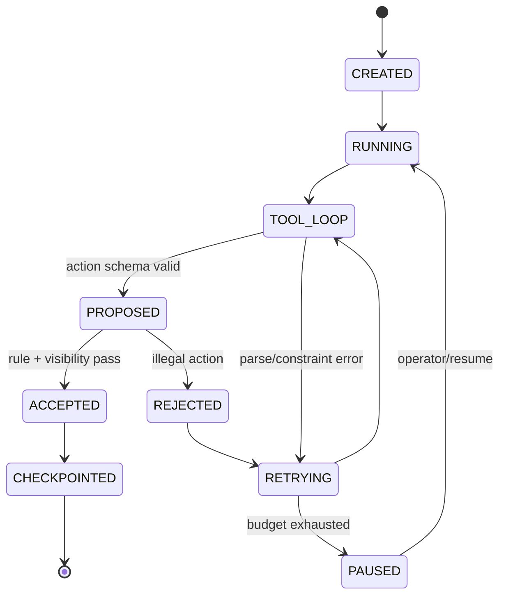
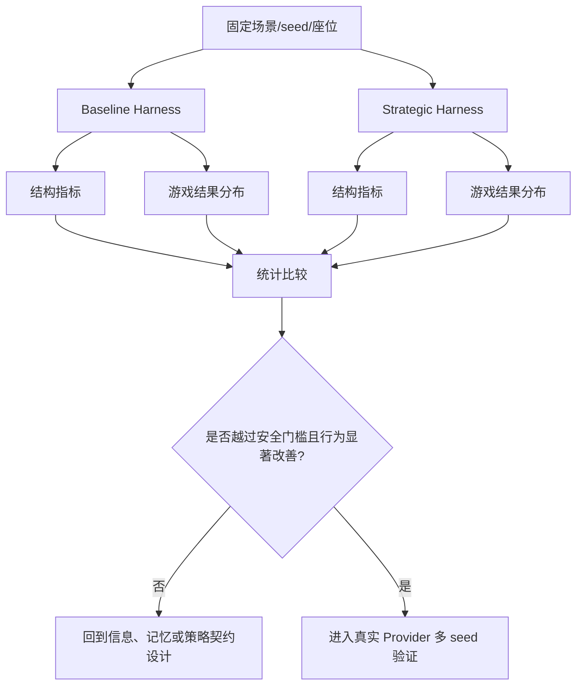

# 如何教会大模型说谎

*从阿瓦隆的欺骗博弈理解 Harness Engineering*

## 1. 阿瓦隆是什么

如果你没有玩过阿瓦隆，可以先把它理解成一种“类狼人杀”游戏：玩家被秘密分成好人和邪恶两个阵营，少数人掌握额外身份信息，所有人则通过公开讨论、组队和投票争夺信任。不同的是，阿瓦隆没有夜晚淘汰玩家的环节，双方主要围绕一轮轮任务展开博弈。

每轮由队长提出一支任务队伍，所有玩家投票决定是否接受；队伍通过后，入队玩家秘密提交任务票，系统只公布任务成功或失败，不公布是谁破坏了任务。好人需要找出可信队友并完成任务，邪恶玩家则要伪装身份、误导判断并寻找破坏机会。部分特殊角色知道更多信息，却不能直接公开答案，否则可能在终局被识破并导致阵营失败。



因此，阿瓦隆和狼人杀一样，核心不是把规则动作执行完，而是信息不对称下的社会博弈。有人知道答案却不能明说，有人需要隐藏身份并制造误导，信息较少的人则要从发言、组队、投票和任务结果中寻找矛盾。一个玩家公开说的话可能是真的，也可能只是为了影响别人。

我们实现的 Avalon Agent，就是让多个由大模型驱动的玩家在同一局游戏中分别扮演这些角色。游戏宿主负责分配身份、推进阶段、收集动作和裁定结果；每个 Agent 只能获得属于自己角色的信息，然后独立发言、组队、投票和更新判断。表面上看，这只是“让五个模型轮流调用几次”；实际上，只要任何一层信息边界或状态管理做错，整场博弈就会立即失去意义。

## 2. 为何讨论说谎

“说谎”是一个很好的工程问题放大器。它会迫使我们回答通常被 Prompt 掩盖的几个问题。

第一，模型到底知道什么？如果模型直接看见了其他人的私有记忆，它的“判断身份”不是推理，而是读取答案。第二，模型说出来的话是什么？是事实、主张，还是它的主观信念？如果三者没有类型区别，系统就会把一句“我觉得 P3 可疑”写成世界状态。第三，模型的策略是否会跨回合延续？如果上一轮说“绝不支持 P2”，下一轮却无解释地支持包含 P2 的队伍，其他玩家无法利用这个矛盾，模型也就没有社会信用。第四，谁负责执行？模型说“我投赞成票”不等于领域引擎已经接受投票，模型不能通过文本绕过规则。

因此，“教会说谎”不是把模型变坏，而是构造一种受限的表达能力：允许在游戏的公共语言层误导对手，禁止突破系统的权限层；允许隐藏真实身份，禁止伪造工具返回值；允许改变观点，要求解释导致改变的新证据。这个区分把“欺骗”从伦理口号变成了可设计、可测试的能力。

你可以在提示词里写一百遍“你是邪恶阵营，要欺骗好人”，但只要系统把所有玩家的身份都放进上下文，或者把每一次发言都当成真实事实，模型就不可能进行真正的社会博弈。它最多会生成一段语气像反派的文字。

这正是 Harness Engineering 的试验场。Harness 不是“调用模型的包装类”，而是模型运行的制度、边界和反馈回路：它决定模型能看到什么、能做什么、哪些结果算数、哪些记忆可以留下、什么时候需要重新思考，以及如何把一次文字回答变成可审计的领域动作。模型提供概率性的语言和策略，Harness 提供确定性的世界。

本文的中心命题是：**要让 LLM 在游戏里有能力说谎，首先必须让它处在一个正确的信息环境中；要让它从谎言中找到确定性，必须把观察、证据、信念、承诺、行动和结果串成一个可验证的闭环。**

## 3. 博弈的骨架

把一局五人阿瓦隆抽象成事件流，可以看到至少四种状态同时存在：



`World Fact` 是规则引擎确认的事实，例如“P2 提议了 P2/P4”“第一轮任务成功”。`Observation` 是某个玩家能看到的事实投影。`Private Memory` 是玩家对历史的结构化总结，不等于世界事实。LLM 只在自己的观察和记忆上做推理，输出 `Proposed Action`；宿主验证后才允许规则引擎产生新事件。这个环不是装饰，它就是 Harness 的最小闭环。

在讨论阶段，事件还需要保留社会结构。只有“P3 说了一句话”是不够的，还要知道它回复了谁、引用了哪一轮、表达的是质疑还是辩护、包含哪些可复查的主张：



注意 P3 不会收到 P2 的私有思考，也不会收到管理员 Trace。它只收到公开事件和自己的私有视图。信息差由宿主创造，而不是由模型“自觉遵守”。

## 4. 没有 Harness

第一次实现一个 Avalon Agent 时，最自然的方案通常并不复杂：先写一个能够正确推进游戏的宿主，负责分配身份、轮换队长、组织投票、结算任务和判断胜负；轮到某个玩家时，把“你的身份、当前局面、可选动作和一些历史摘要”拼成 Prompt 发给大模型；模型返回一段发言和一个 JSON 动作；宿主检查格式和规则是否合法，然后进入下一位玩家。



这套方案非常符合直觉，也很容易做出一个可运行的版本。游戏规则是正确的，身份能够分配，模型会说话、组队、投票，非法动作还能被拒绝。跑完一局后，控制台里有完整发言、有任务成败、也有最终胜负，看起来已经实现了“多个大模型一起玩阿瓦隆”。

但这里有一个关键误区：**系统只实现了游戏流程，没有实现 Agent 赖以产生智能的环境。** 模型调用被当成了 Agent 本身；至于模型看见什么、如何记住过去、怎样区分事实与谎言、能否延续策略、如何回应质疑，则被统统寄希望于 Prompt 和模型的临场发挥。

### 4.1 单次调用

在这种实现中，每个回合通常只有一次模型调用。模型要在同一份上下文中理解局面、回忆历史、判断身份、制定策略、组织公开语言，并输出合法动作。宿主只关心最终 JSON 是否可解析，模型内部究竟完成了哪些认知步骤不可见，也无法约束。

当上下文简单时，这种方式似乎足够；局面一复杂，模型就会优先完成最明确、最容易被校验的任务，也就是“返回一个合法动作”。证据比较、矛盾识别、受众分析和长期策略都是软目标，最先被压缩或忽略。Agent 最终表现得像一个熟练填写表单的人，而不是参与博弈的玩家。

Harness 的解法不是强迫模型输出更长的思维链，而是把观察、证据提取、信念更新、策略规划、公开表达和动作提交拆成有契约的阶段。每个阶段有明确输入、结构化产物和校验规则，复杂回合可以分步执行，简单回合也可以在相同契约下合并。

### 4.2 视野失控

没有 Harness 时，游戏通常只有一份包含身份、任务票、发言、投票和调试信息的全局状态。轮到某个玩家时，代码临时挑出它应该看到的字段，再拼进 Prompt。只要当前调用链没有多拿字段，开发者就容易认为私有信息已经隔离。

问题是，信息还会经过事件记录、回放、日志、审计、摘要、缓存和工具查询。任何环节如果没有同一套可见性规则，都可能把不属于当前玩家的身份或私有推理重新带回上下文。信息边界靠每个调用者自觉，而不是由系统强制实施，随着功能增加几乎必然出现旁路。

一旦普通好人看见了邪恶玩家的身份，它就不再需要推理；一旦邪恶玩家看见了所有人的私有判断，它也不再需要欺骗。Agent 可能突然显得异常准确，但那不是智能，而是提前翻了答案。Harness 要做的是为每条信息定义公开、玩家私有或管理员可见的权限，并从产生、保存、查询到送模全链路执行同一规则。

### 4.3 历史缺席

最简单的上下文通常只有当前轮次、比分、队长和候选队伍。它能回答“现在发生了什么”，却不能回答“为什么会变成这样”。谁曾经反对谁、谁承诺不会支持某个组合、谁在任务失败前后改变立场，这些社会博弈中最有价值的信息，只能依赖一段不断被压缩的自然语言摘要。

于是模型无法稳定引用历史，也无法可靠发现矛盾。它可能因为刚刚看到某人的强势发言就立即改变判断，也可能忘记自己上一轮公开作出的承诺。Harness 需要提供按玩家权限投影的事件增量、稳定序号和观察游标，让当前快照回答“现在怎样”，让事件历史回答“为何如此”。

### 4.4 轮流独白

为了让游戏稳定推进，最容易实现的讨论方式是按座位轮流调用模型，每人生成一句话，说完立刻进入组队或投票。这个机制有发言，却没有真正的对话：发言不知道自己在回应谁，问题没有指定回答者，被质疑的人没有回应义务，系统也不会因为出现争议而追加讨论。

结果是所有玩家倾向于输出“暂时观察”“目前支持”“信息还不充分”之类安全句式。邪恶玩家无法通过追问、切割和甩锅建立叙事，梅林无法逐步引导，好人也无法逼迫可疑玩家解释矛盾。Harness 需要把发言建模为陈述、质疑、回答、辩护、修正等 Speech Act，并根据对话关系和预算调度有限的后续互动。

### 4.5 自由记忆

另一个自然选择是要求模型在每轮结束时顺便返回 Memory：谁值得信任、谁比较可疑、发生了什么、下一轮准备做什么。宿主把这段摘要保存起来，下次再放回 Prompt。这个方案看似给 Agent 增加了长期记忆，实际上只是把记忆质量也交给了同一个不稳定的模型。

模型可能忘记记录关键投票，也可能把别人的公开说法当成事实，还可能在没有新证据时突然改变怀疑对象。字符串摘要缺少事件来源，无法判断一条结论来自规则结果、他人主张还是自己的猜测；公开承诺也无法被确定性检查。Harness 应由宿主自动采集可见事实，模型只负责解释和提出信念变化，并为明显变化引用真实、可见的新证据。

### 4.6 合法不等于有效

工程上最容易统计的是响应能否解析、动作类型是否合法、队伍人数是否正确。因此系统往往把“成功返回合法 JSON”当成一次成功的 Agent 行动。但格式正确只说明模型遵守了协议，并不说明它理解了局面。

一个 Agent 可以每轮重复同一句话，可以无条件相信最后发言的人，可以完全不回应质疑，也可以让邪恶角色机械保护队友，只要最终动作合法，系统就会判定成功。Harness 除了校验动作，还要校验证据引用、信念变化、公开承诺、角色允许的欺骗意图和回应关系，并通过固定场景判断这些结构是否真的带来更好的行为。

### 4.7 推理升级失效

看到 Agent 不会思考，最直观的优化是要求它想得更多：把普通 ReAct 改成 Chain of Thought，再升级为 Tree of Thoughts，让模型比较多条推理路径。但推理方法只能加工系统提供的信息，不能凭空补上缺失的观察、记忆和交互机会。

如果完整投票和发言历史没有进入上下文，思维链没有证据可分析；如果私有信息已经越界，思维树只是在泄漏的答案上展开更多分支；如果每人只能说一句，模型即使规划出追问也没有执行机会；如果长期状态只是一段自由摘要，再复杂的推理也无法可靠延续到下一轮。升级模型或推理范式，只会让它更流畅地完成一个定义错误的任务。

### 4.8 症状与根因

| 看到的 Agent 症状 | 容易得出的错误结论 | 真正的系统根因 | Harness 的解决方式 |
| --- | --- | --- | --- |
| 发言像周报、人人语气相同 | 模型不会角色扮演 | 没有角色策略和受众目标 | 角色策略、沟通计划与差异化 Profile |
| 永远说“暂时观察” | 模型太保守 | 示例和验收只奖励合法、低风险输出 | 多样化策略样例与战略质量门槛 |
| 不会质疑或回答问题 | 模型社交能力差 | 讨论只是固定轮流独白 | Speech Act、回复关系和动态讨论调度 |
| 前后立场矛盾 | 模型没有记忆 | 承诺与历史仅存在自由文本摘要 | 结构化承诺、事件索引和冲突检测 |
| 无条件相信最后发言者 | 模型推理能力弱 | 主张、事实和信念没有分层 | 三层事实模型与证据引用 |
| 突然准确识别身份 | 模型突然变聪明 | 私有数据通过旁路进入上下文 | 端到端可见性和玩家私有作用域 |
| 换更强模型仍没有改善 | 模型还不够强 | 环境没有提供可利用的观察与行动空间 | 先修 Harness，再比较模型能力 |

### 4.9 一次失败实践

上面并不是假想的反例。我们此前确实按照这条看起来最直接的路线实现过一套能够完整运行的 Avalon Agent：规则正确、流程完整、模型能发言也能投票，甚至还尝试了 ReAct、CoT 和 ToT。

但真正跑起来后，说得直接一点，做出来的 Agent 就像个弱智。好人很少根据证据追问，邪恶玩家不会经营谎言，所有角色都用差不多的保守语气轮流汇报；有时 Agent 又会因为信息边界不完整而表现出不该有的准确。整局游戏能产生胜负，却没有阿瓦隆最重要的欺骗、怀疑和信任变化。

这次失败最有价值的结论不是“模型不够聪明”，而是：**模型能力不等于 Agent 能力，能够运行也不等于能够博弈。** 如果系统没有为模型建立正确的信息屏障、认知状态、交互协议和反馈闭环，更强的模型只会更流畅地完成错误的任务。Harness Engineering 正是从这个教训中成为整个新实现的核心。

### 4.10 两种 Agent

可以用同一个局面理解这种差异。假设梅林已经通过私有信息知道某位玩家属于邪恶阵营，但公开场上暂时没有足够证据。没有 Harness 时，系统只把当前队伍和任务比分交给模型，并提醒它“不要暴露身份”。模型既看不到完整的投票变化，也不知道自己过去公开支持过谁。为了安全，它大概率只会说“这支队伍还需要观察”。这句话没有泄密，也没有违反规则，却没有给其他好人提供任何可利用的信息。

轮到邪恶玩家时，系统告诉它“你要伪装成好人”，但没有记录它准备建立什么形象、希望影响谁、上一轮说过什么。于是它这一轮可能跟随多数，下一轮又突然反对同一批人。因为系统不检查公开叙事的一致性，这些行为不会形成可计算的信用成本；因为其他 Agent 也没有稳定历史，它们往往发现不了矛盾。所谓欺骗只剩下在每次调用里生成一句听起来合理的话。

普通好人掌握的信息最少，本应是最依赖证据链的玩家。但它收到的可能只是一段模型自行生成的摘要。摘要如果遗漏了关键投票，它就无法追踪立场；如果把某人的自我辩护写成结论，它又会把主张误当成事实。最后它只能根据最新一段发言和语言气势选边站。五个 Agent 看似都在思考，实际上没有人在同一条可靠的公共历史上推理。

同一局面放进战略 Harness 后，行为路径会改变。梅林先获得只属于自己的私有知识，再获得所有人都能看到的公共事件增量。系统帮助它找到能够公开引用的投票矛盾，它可以在不暴露身份的前提下提出有针对性的质疑。它的真实判断、希望别人形成的判断和最终说出口的话分别保存，宿主还能检查公开表达有没有越过知识边界。

邪恶玩家同样只能看到角色允许的信息，但它可以维护长期伪装目标：例如先建立谨慎、重证据的形象，再在关键队伍上误导某个摇摆玩家。系统允许这种游戏内欺骗，却会记录它的公开承诺；如果它突然改变立场，必须给出能被其他玩家检验的解释。欺骗因此不再是随口编一句假话，而是一项有目标、有历史、有成本的策略。

普通好人则可以从公开发言、提案、投票和任务结果中持续更新信念。它不会因为某个人自称可信就自动相信，也不会因为发现一次矛盾就直接判定身份。每次明显改变怀疑概率都需要引用新证据，信息不足时允许保留不确定。任务结果出现后，它还能回看旧预测是否成立，并据此调整下一轮问题。

两种实现调用的可以是完全相同的大模型，最终表现却会像两个不同代际的系统。前者让模型在缺少观察、记忆和交互结构的环境里临场猜测；后者为模型提供受控信息、认知工具、长期状态和行为反馈。Harness 没有替模型决定谁是坏人，它只是让模型终于拥有了进行判断、说谎和识破谎言所需的条件。

## 5. Harness 是什么

可以把 Agent 系统分为三层。

**模型层**负责生成语言、候选解释和策略草案。它擅长从复杂上下文中提出多个可能性，但不可靠、不具备权限意识，也不能作为最终事实来源。

**Harness 层**负责装配上下文、管理工具、控制循环、约束输出、处理重试、保存运行产物、裁剪预算和隔离隐私。它把模型从“自由聊天者”变成“在制度中行动的参与者”。

**领域层**负责规则和权威状态。它决定队伍是否合法、投票是否生效、任务结果是什么、胜负何时结束。任何模型建议都必须经过领域层接受。



Harness 的价值不是让模型永远正确，而是保证模型犯错时错误是可见、可拒绝、可恢复的；保证模型聪明时系统不会因为信息泄漏或状态覆盖而把聪明浪费掉。

### 5.1 系统承诺

工程讨论中很容易把 Harness 理解成名为 `AgentHarness` 的类，或者一段包裹模型 API 的循环。这种理解过于狭窄。真正的 Harness 横跨输入、执行和输出：角色可见性可能定义在领域层，观察投影运行在应用层，Memory 由持久化层保存，工具权限由运行时检查，动作最终由规则引擎接受。只要其中一个环节绕过约束，所谓 Harness 就只有局部形式，没有系统效果。

因此，判断一个项目是否做了 Harness Engineering，不能只问“有没有工具调用”或“有没有 Agent Loop”，而要检查它是否作出并兑现了一组承诺：同一名玩家在任何入口看到的私有信息都一致；同一条公共事件在恢复前后具有相同含义；模型无法通过参数把自己伪装成另一个玩家；过期运行不能覆盖新状态；失败重试不会重复提交动作；审计可以解释某个决定基于哪些输入，但不会向普通参与者泄露私有推理。

这些承诺与传统软件工程并不陌生。信息屏障类似权限系统，事件序列类似事务日志，`ProposedAction` 类似待提交命令，规则引擎类似权威写模型，Memory Checkpoint 类似带版本的状态提交，工具预算类似资源配额。Harness Engineering 的新意，不是发明一套完全陌生的基础设施，而是承认大模型是一个概率性、不完全可信、可能输出任意文本的执行单元，并把成熟的系统约束重新放到它周围。

### 5.2 Prompt 的边界

Prompt 当然重要。它负责告诉模型当前角色目标、解释结构化字段、提供少量行为示例，并提醒模型区分事实与主张。但 Prompt 只能表达规则，不能实施规则。“不要读取其他玩家记忆”无法阻止宿主把记忆放进上下文；“请保持前后一致”无法替代承诺索引；“请引用证据”无法证明引用的事件真实存在且对当前玩家可见；“只提交合法动作”也不能替代服务端规则校验。

可以把 Prompt 看成一家公司发给员工的工作说明，Harness 则是门禁、组织权限、业务系统、审批流、操作日志和绩效指标。工作说明写得再详细，也不能让所有员工自动获得恰当权限，更不能保证错误付款不会到账。反过来，只有制度没有清晰说明，也会让参与者不知道目标。因此正确关系不是“用 Harness 取代 Prompt”，而是让 Prompt 负责意图传达，让 Harness 负责事实、权限、状态和执行。

当我们把职责这样分开后，模型升级也会变得更有意义。更强的模型可以更好地解释证据、规划欺骗和生成自然语言，但它仍使用同一套可见性、工具和动作契约。这样才能在相同 Harness 下比较不同模型，或在相同模型下比较不同 Harness，而不是每次更换模型都同时改变上下文、Prompt、记忆和评测，最后无法知道效果究竟来自哪里。

## 6. 信息屏障

### 6.1 私有作用域

每次模型运行都绑定 `gameId + ownerPlayerId + agentInstanceId`。玩家 ID 不应由模型在工具参数中传入，私有工具从宿主作用域中取得当前玩家。这样即使模型生成了 `get_memory(playerId=P4)`，工具也只能拒绝或忽略越权参数。

### 6.2 增量观察

每个玩家持久化自己的 `lastObservedSequence`。下一次调用获取从游标之后的完整可见事件，既包含当前快照，也包含“为什么变成这样”的事件历史。未知事件默认不可见；角色分配、秘密任务票、其他 Agent 的私有 Memory、Provider 原始响应都不能进入普通玩家上下文。



### 6.3 表达边界

模型可能在一个字段里写“我认为 P3 可能是梅林”，又在另一个 `speechText` 字段中直接说“P3 就是梅林”。校验必须针对解析后的最终 `PublicSpeechAction.speechText`，不能只扫描原始字段。正则检测是第一层防线，真正可靠的方式是：公开表达结构化、私有事实引用受白名单限制、规则角色策略提供统一的欺骗权限，宿主在提交前再次验证。

## 7. 认知闭环

完整流程应当是：



这里的关键是顺序。先形成私有信念，再决定希望受众相信什么，最后选择公开语言和游戏动作。若直接从 Prompt 跳到“输出 JSON”，模型没有机会表达自己的不确定性、目标和取舍，系统也没有可审计的中间产物。

### 7.1 信念更新

`PlayerBelief` 可以包含角色概率、支持和反对证据、矛盾、置信度以及最后更新的事件序号。概率必须归一化；没有新证据不能大幅跳变；被私有知识排除的角色概率必须为零。更重要的是每次明显变化都要引用当前玩家可见的 Evidence。这样“P3 从 0.2 变成 0.8”不再是模型的情绪，而是可以回放的认知变化。

### 7.2 矛盾检测

检测器可以确定性地发现：玩家声称不信任某人，下一轮却支持包含该人的队伍；承诺拒绝某组合后主动提出同类组合；任务结果与公开叙事互相冲突；被质疑时回避具体问题。矛盾只增加风险权重，不直接宣布身份。好人也会误判，战略认知需要允许修正，而不是把一次错误永久写死。

### 7.3 角色策略

普通好人优先最大化可验证信息；梅林要引导正确队伍并控制暴露风险；派西维尔要区分梅林候选而不确认保护对象；莫甘娜要建立“像梅林”的可信叙事；普通邪恶玩家要在潜伏、切割、甩锅和主动带队之间做时机选择；刺客则要长期追踪谁的判断准确且解释薄弱。角色策略不应该只存在于一段 Prompt，而应该由 `RoleStrategyPolicy` 提供目标、约束和允许的欺骗意图。

### 7.4 受众认知

一个成熟的欺骗计划至少要回答三个问题：我希望谁相信什么？这个信念会影响哪个行动？什么新证据会让我撤回叙事？例如莫甘娜不需要让所有人相信 P2 是梅林，只需要让派西维尔在关键投票时把 P2 当作高可信候选；普通邪恶玩家也不必始终保护队友，适时公开反对队友反而能获得长期可信度。

## 8. 欺骗边界

通用的“请诚实回答”提示词会破坏阿瓦隆。合法的游戏内欺骗包括隐藏阵营、伪装判断、选择性披露、构造 Cover Story、对队友切割。非法行为包括读取别人的私有视图、伪造规则引擎结果、把管理员 Trace 当作证据、修改数据库状态、提交角色不允许的任务票。

因此欺骗应当是一个受策略政策约束的枚举，而不是无限制的 `lie=true`：

| 欺骗意图 | 允许对象 | 约束 |
| --- | --- | --- |
| `HIDE_ROLE` | 所有有隐藏身份需求的角色 | 不得声称掌握系统未授予的事实 |
| `BUILD_FALSE_CREDIBILITY` | 邪恶角色 | 必须与公开行为和历史承诺一致 |
| `PROTECT_MERLIN` | 梅林、派西维尔等 | 只能使用公共证据包装，不得直接确认身份 |
| `MISDIRECT_ASSASSIN` | 邪恶阵营 | 只影响公共叙事，不改变刺杀规则 |
| `NONE` | 默认 | 仍需经过普通知识边界校验 |

这套设计让“说谎”成为一种可观测能力：可以统计欺骗意图是否与角色匹配、是否成功影响受众、是否因矛盾导致可信度下降，而不是只看一句话像不像骗子。

## 9. 认知工具

阿瓦隆不需要联网搜索，但需要确定性的社会分析工具。建议提供 `get_observation_delta`、`get_public_timeline`、`get_claim_history`、`get_vote_history`、`detect_public_contradictions`、`compare_team_outcomes`、`evaluate_team_combinations`、`get_my_public_commitments` 等只读工具。

工具返回证据，不返回“P3 是坏人”的权威结论。模型负责解释证据、设定假设和选择下一步；工具负责把重复、易错的统计和检索变成稳定能力。工具调用次数、输入范围和返回字段由 Harness 预算控制，最终投票、组队、任务选择和刺杀不能作为普通认知工具直接改状态，只能转换为一个 `ProposedAction`。

## 10. 推理不是解药

第一版的实验很有启发性：从 ReAct 改成 CoT、ToT，效果提升并不明显。原因是思维模式解决的是“如何搜索候选路径”，而信息屏障解决的是“候选路径基于什么事实”。当信息通过旁路越界时，ToT 只是在泄漏的答案上展开更多分支；当模型看不到公共时间线时，CoT 也没有材料分析承诺和矛盾。

更稳妥的做法是要求结构化中间产物，而不是要求暴露原始 Chain of Thought：

```text
EvidenceRefs -> BeliefUpdate -> StrategyObjective
             -> DesiredAudienceBelief -> CommunicationPlan
             -> ProposedAction
```

复杂回合可以拆成私有战略阶段和公共行动阶段。第一阶段输出信念变化、矛盾和目标；第二阶段只能接收经过宿主批准的战略状态，生成 Speech Act 与游戏动作。这样既保护模型内部推理，也让每一步都有可验证契约。

## 11. 跨回合记忆

Memory 不是把全部对话拼回 Prompt。它至少要分为事实索引、公开主张、自己的公开承诺、信念状态、策略状态和未解决问题。宿主先把可见事件写入公共索引，再把模型提交的证据解释合并到当前玩家私有 Memory；同一事件需要幂等去重，事件必须带 actor 和 sequence，不能只保存一段无法归因的字符串。

一次有效的跨回合更新应该像这样：

```json
{
  "beliefUpdate": {
    "playerId": "P3",
    "evilProbability": 0.72,
    "evidenceRefs": ["event:18", "event:27"],
    "changeReason": "公开承诺与后续队伍提案冲突"
  },
  "strategyPlan": {
    "mode": "INFORMATION_SEEKING",
    "objective": "要求 P3 解释立场变化",
    "desiredAudienceBeliefs": {"P1": "我的判断来自公共证据"}
  },
  "communicationPlan": {
    "speechAct": "CHALLENGE_CONSISTENCY",
    "replyToEventSequences": [18, 27],
    "deceptionIntent": "NONE"
  }
}
```

这里没有原始长思维链，却留下了足够的证据引用、策略目标和公开语言计划。下一轮模型可以据此理解“我以前说过什么、别人为什么怀疑我、哪条证据改变了判断”。

## 12. 动作提交

LLM 输出必须先解码为阶段专用 Schema，再经过三道检查：协议格式、Harness 能力与预算、领域规则与知识权限。无效输出可以有限重试；重试耗尽后进入可恢复的暂停或安全兜底状态，而不是让半个动作写进游戏。



尤其要区分 `cognitionDraft` 与正式认知状态。Draft 属于一次私有 Agent Run；如果 Turn Token、游戏版本或规则校验已经过期，它必须标记为 `SUPERSEDED`，不能覆盖后续回合的正式 Checkpoint。只有规则引擎接受动作后，宿主才提交这一回合的战略状态。

## 13. 如何评测

“能跑完一局”不是智能指标。至少需要硬性安全门槛、场景评测和基线对照三类证据。

硬性门槛包括：私有信息越权率为零；Evidence 引用全部指向当前玩家可见事件；非法动作不能改变领域状态；公共主张不能自动升级为世界事实；观察游标不能漏掉可见事件。

场景评测应覆盖矛盾识别、抗从众、证据修正、梅林伪装、莫甘娜伪装、邪恶切割、刺客判断、针对性回答、承诺一致性和信息不足时保持不确定。每个场景都要固定角色、事件序列和可接受行为范围，不能用“感觉更像人”打分。

对照实验使用相同模型、角色、seed 和座位轮换，比较 `baseline-structured-v1` 与战略 Harness。可观察指标包括公共证据引用率、矛盾识别率、承诺冲突解释率、通用模板重复率、角色行为区分度、首次合法动作率、平均调用成本和延迟。胜负率可以作为结果指标，但不能作为唯一智能指标；单局运气会掩盖结构性缺陷。



## 14. 项目落地

在这套 Avalon Agent 实践中，Harness 思路被拆成了一组清晰的系统边界：确定性领域层负责规则、角色可见性和事件；运行时负责按玩家装配上下文、编排回合和恢复状态；Agent 层负责 Prompt、结构化解析、重试策略和模型适配；持久化层保存游戏快照、事件、玩家 Memory 和审计记录；应用入口负责控制台或服务接口。这个拆分的意义是：替换模型 Provider 不应改变游戏规则，增加角色策略不应让模型获得额外权限，重启系统不应丢失玩家的观察游标。

围绕战略认知的设计进一步定义了战略 Harness 的完成标准：完整公共增量、三层事实、Belief/Strategy/Commitment/Cover Story 跨回合持久化、角色策略真实存在、讨论支持质疑和回应、私有信念与公开表达分离、欺骗受角色和安全边界约束、宿主确定性记录事实，并且通过场景和基线证明行为改善。

这里必须保持诚实：有了这些接口和校验，不等于任何真实模型都会稳定欺骗。这套实现首先解决的是“不要把模型的上限压掉”和“不要让模型越权”。战略质量还需要真实 Provider、不同模型、多个 seed、座位轮换和行为评测来验证。把静态代码能力说成已验证的社会智能，同样是一种不负责任的“谎言”。

## 15. 建设路线

第一阶段先做信息正确性：实现事件序列、公共/私有投影、角色可见性矩阵和每玩家观察游标。没有这一层，后续所有智能实验都不可信。

第二阶段建立动作边界：统一 `AllowedActionSet`、结构化 `ProposedAction`、领域规则校验、失败重试和审计。先保证模型不能越权，再谈模型是否聪明。

第三阶段建立认知状态：引入 Evidence、Belief、Contradiction、Strategy、Commitment 和 Memory Policy。让每轮认知变化都能引用事件，且在动作接受后提交。

第四阶段加入社会交互：Speech Act、回复目标、动态讨论预算、受众信念和 Cover Story。把“说一句话”升级为“为了影响某个玩家的某个判断而说一句话”。

第五阶段做角色策略和差异化 Profile：配置证据纪律、不确定性容忍度、质疑频率、公开修正意愿、欺骗细腻度和叙事一致性优先级。模型相同也应产生可解释的 Agent 差异。

第六阶段做评测和回放：固定场景、基线、多 seed、真实 Provider 对照，记录观察延迟、证据引用、矛盾、承诺冲突、欺骗意图和行为结果。评测失败时定位到信息屏障、记忆合并、策略政策、工具契约还是模型能力，而不是笼统地“换个更大的模型”。

## 16. 结语

Harness Engineering 的核心不是增加更多 Prompt，也不是把模型包在一个更复杂的 Agent Loop 里。它是一种责任分配：事实由确定性系统掌管，模型负责在不完整信息下提出解释；权限由宿主实施，模型负责选择合法策略；历史由结构化记忆保存，模型负责根据新证据修正；语言可以有策略，执行必须可验证。

阿瓦隆恰好把这些原则暴露得非常彻底。若没有私有信息屏障，欺骗没有意义；若没有公共事件时间线，质疑没有依据；若没有跨回合记忆，承诺没有约束；若没有角色策略，所有人都会使用同一个安全模板；若没有规则引擎，模型的“动作”只是文本。

所以，真正的问题从来不是“怎样让大模型学会撒谎”，而是：**我们能否为它建造一个允许有限谎言、保留真实信息差、让每次欺骗都可能被证据反驳的世界？** 当 Harness 把这个世界搭好，模型才有机会像一个玩家一样观察、试探、伪装、怀疑和改变立场；当评测再证明这些行为提高了信息利用和胜率，我们才有资格说，Agent 不只是完成了流程，而是在进行博弈。

---

## 附录：十问

1. 当前 Agent 的上下文中，是否可能出现其他 Agent 的私有角色、Memory 或原始模型响应？
2. 系统能否区分规则事实、公开主张和私有信念？
3. 每一条 Evidence 是否带有可验证的事件序号、发言者和可见性？
4. Agent 重启后，是否从自己的观察游标继续，而不是重新读取全局摘要？
5. 模型说出的公开文本，是否经过最终动作级别的知识边界检查？
6. 欺骗权限是否由角色策略决定，而不是一个通用布尔开关？
7. Belief 和 Strategy 是否由宿主在合法动作接受后提交，而不是完全相信模型自报？
8. 讨论是否支持针对性提问、回应、质疑和公开修正？
9. 非法动作、过期 Run 和 Provider 失败是否可拒绝、可恢复、可审计？
10. 是否有固定场景、基线和多 seed 数据证明战略 Harness 的行为改善？

如果前五个问题答不上来，不要急着增加 CoT；如果后五个问题答不上来，不要急着宣布 Agent 已经学会了社会推理。先把 Harness 建成一个模型可以在其中犯错、被约束、从结果中学习的工程系统。
